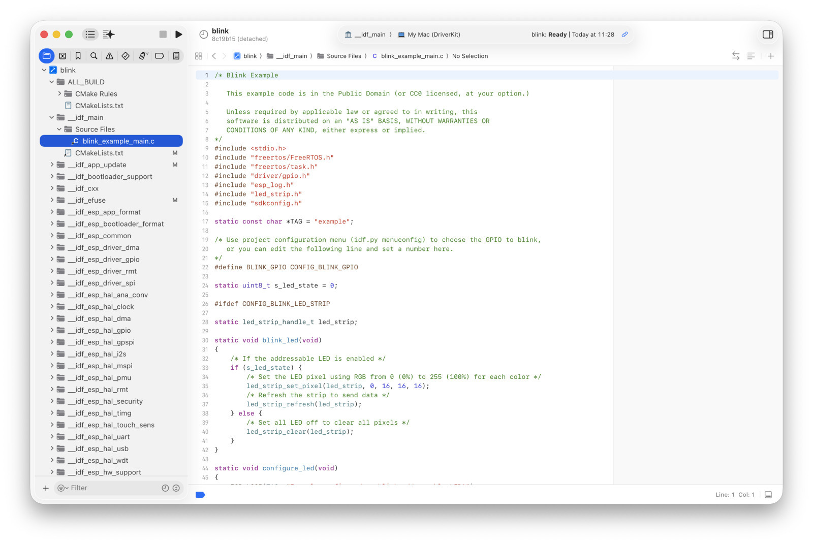

### xcesp: ESP-IDF development with Xcode

# xcesp

xcesp provide shim scripts that allow building ESP-IDF compatible projects from within Xcode,
using Espressif's clang toolchain, also supporting Xcode's built-in Apple Intelligence features
(via Claude, Ollama, etc.)

Xcode projects are automatically maintained from existing CMake files.

See the corresponding [blog post for details](https://kohlschuetter.github.io/blog/posts/2026/06/08/xcode-esp/).

<figure></figure>

# Mode of operation

The main "xcesp" script is used to setup and maintain an Xcode project for an existing ESP-IDF
CMake project.

A custom "Xcode Toolchain" provides shim scripts for clang/clang++, libtool and lipo, so they
do the right thing: while Xcode thinks we're developing for MacOS DriverKit, we actuallly run
the very same clang incantations `idf.py` would do. 

# Installation and usage

In order to use xcesp, you need to run the installer script, which adds `xcesp` to the PATH, and
sets up symbolic links for the toolchain and ESP-IDF SDK.

    ./xcesp-install

To open or create an Xcode project for a given ESP-IDF project, just `cd` to that project directory
and run `xcesp. For example,

    cd $IDF_PATH/examples/get-started/blink
    
    # If `sdkconfig` does not yet exist, configure the ESP target device first
    xcesp --set-target esp32s2
    
    # otherwise just run without arguments (this can also be used to simply open the Xcode project later on)
    #xcesp

An Xcode window should open with "__idf_main"/"My Mac (DriverKit) as the Scheme and Device Target.
Your main code can be found under `__idf_main`; use Xcodes `Filter` pane at the bottom  of the page to quickly find it.

All xcesp/Xcode related artifacts are stored under `build-xcesp` folder next to ESP-IDF's standard
`build` folder. Run `xcesp -f` to forcibly rebuild that folder (which is usually not necessary, but still...)

`xcesp` has several other command-line options (visible via `xcesp --help`):

    Syntax: xcesp [--help|OPTIONS] [<path-to-IDF-project>]
    
    OPTIONS:
            --set-target TARGET Set the ESP device target (invokes idf.py set-target)
            -t TARGET
    
            --menuconfig        Run idf.py menuconfig before setting up the Xcode project
            -m
    
            --force             Create the "build-xcesp" directory from scratch.
            -f                  In combination with "--set-target", also deletes the "build" directory
    
            --flash             Flashes the binary to the device (using idf.py)
    
            --xcbuild           Build the project using xcodebuild
            -x
    
            --watch             Display serial output from the device (using idf.py monitor)
            -w                  Exit with CTRL-]
    
            --no-open           Do not automatically open the Xcode project
            -O
    
            --open              Automatically open the Xcode project, even if we wouldn't
            -o                  (e.g., when specifying --monitor, --flash, --xcbuild)
    
            --scheme SCHEME     Use SCHEME as the build scheme for xcodebuild
            -s                  (default: ALL_BUILD)
    
            --same-derived-data Use the same DerivedData folder for interactive Xcode and xcodebuild
    
            --idf COMMAND       Run the specific idf command
            -i COMMAND

# Legal Notices

Copyright 2026 Christian Kohlschütter

SPDX-License-Identifier: Apache-2.0 
See NOTICE and LICENSE for license details.
